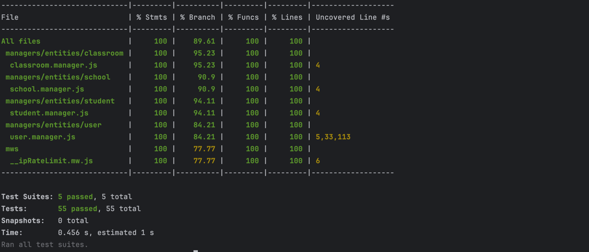
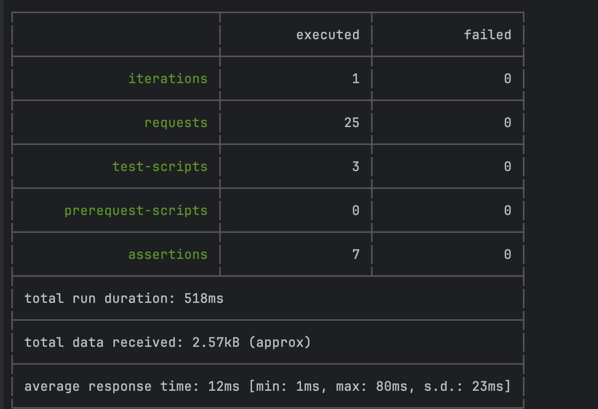
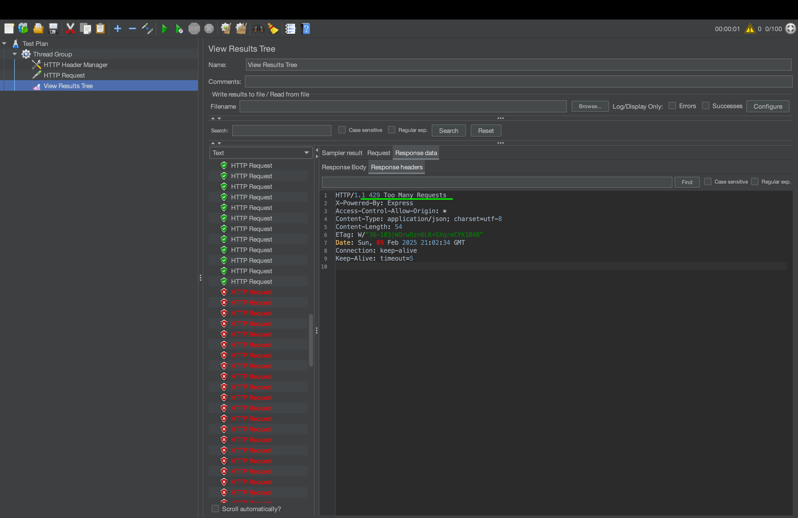

# School Management API - Documentation

## Table of Contents

1. [Configuration Setup](#configuration-setup)
2. [Database Schema](#database-schema)
3. [API Documentation](#api-documentation)
4. [Authentication](#authentication)
5. [Error codes](#error-codes)
6. [Ip Rate Limiting](#ip-rate-limiting)
7. [Testing](#testing)
   - [Unit Test](#unit-testing)
   - [Integration Testing](#integration-testing)
   - [Load Performance testing](#load-performance-testing)
5. [Architectural Changes](#architectural-changes)

---

## Configuration Setup

This section describes how to configure and set up the **School Management API** using Docker Compose.

### Prerequisites

Ensure you have the following installed:

- [Docker](https://docs.docker.com/get-docker/)
- [Docker Compose](https://docs.docker.com/compose/install/)

### Step 1: Set Up Environment Variables

1. Copy the `.env.example` file to create a `.env` file:

   ```sh
   cp .env.example .env
   ```

2. Open the `.env` file and configure the necessary environment variables:

   ```
   LONG_TOKEN_SECRET=
   SHORT_TOKEN_SECRET=
   NACL_SECRET=
   IP_RATE_LIMIT=
   IP_RATE_WINDOW=
   ```

   Replace the values with the appropriate secrets and settings.

### Step 2: Run the Application with Docker Compose

To build and start the application along with its dependencies (**MongoDB** and **Redis**), run:

```sh
docker compose up -d --build
```

- `-d` runs the containers in **detached mode**.
- `--build` ensures the latest changes are applied during the build process.

### Step 3: Verify Running Containers

After starting the services, verify if they are running using:

```sh
docker ps
```

You should see the following services:

| Container | Image          | Ports         |
| --------- | -------------- | ------------- |
| `app`     | Custom Build   | `5111:5111`   |
| `mongo`   | `mongo:latest` | `27017:27017` |
| `redis`   | `redis:latest` | `6379:6379`   |

### Step 4: Stopping the Containers

To stop the containers while preserving data:

```sh
docker compose down
```

To stop and remove all containers, networks, and volumes:

```sh
docker compose down -v
```

---

## Database Schema

This project uses **MongoDB** as its database. Below is an **overview** of the database schema.

```
User (1:N) → School (1:N) → Classroom (1:N) → Student
+----------------+      +----------------+      +----------------+      +----------------+
|     User      | ----> |    School      | ----> |   Classroom   | ----> |    Student    |
+----------------+      +----------------+      +----------------+      +----------------+
| _id (ObjectId) |      | _id (ObjectId) |      | _id (ObjectId) |      | _id (ObjectId) |
| username       |      | name           |      | name           |      | firstname      |
| email          |      | fullAddress    |      | schoolId (*)   |      | lastname       |
| password       |      | created_by (*) |      | capacity       |      | age           |
| role           |      |                |      | resources []   |      | grade         |
|               |      |                |      | created_by (*) |      | classroomId (*) |
+----------------+      +----------------+      +----------------+      +----------------+
```

### **Relationships:**

1. **User → School** (1:N)
   - A user (admin) can create multiple schools.

2. **User → Classroom** (1:N)
   - A user (admin) can create multiple classrooms.

3. **User → Student** (1:N)
   - A user (admin) can create multiple students.

4. **School → Classroom** (1:N)
   - A school can have multiple classrooms.

5. **Classroom → Student** (1:N)
   - A classroom can have multiple students.

---

## Authentication

The authentication system in **School Management API** works as follows:

1. **Obtain a Long Token:**
   - When a user registers via `POST /api/users` or logs in via `POST /api/users/login`, they receive a **longToken**.

2. **Exchange for a Short Token:**
   - The long token must be exchanged for a short-lived token using `POST /api/token/v1_createShortToken`.

3. **Use the Short Token for API Requests:**
   - The short token is required for authenticated API requests.

This mechanism ensures security by limiting long-term token exposure.

---

## API Documentation

To interact with the API endpoints, refer to the **Postman Collection** provided in the repository:

**Postman Collection:** `school-management-api.postman_collection.json`

### **User APIs:**
- `POST /api/users` - Create a user
- `GET /api/users?id={userId}` - Get a user by ID
- `PUT /api/users?id={userId}` - Update a user
- `DELETE /api/users?id={userId}` - Delete a user

### **School APIs:**
- `POST /api/schools` - Create a school
- `GET /api/schools?id={schoolId}` - Get a school by ID
- `PUT /api/schools?id={schoolId}` - Update a school
- `DELETE /api/schools?id={schoolId}` - Delete a school

### **Classroom APIs:**
- `POST /api/classrooms` - Create a classroom
- `GET /api/classrooms?id={classroomId}` - Get a classroom by ID
- `PUT /api/classrooms?id={classroomId}` - Update a classroom
- `DELETE /api/classrooms?id={classroomId}` - Delete a classroom

### **Student APIs:**
- `POST /api/students` - Create a student
- `GET /api/students?id={studentId}` - Get a student by ID
- `PUT /api/students?id={studentId}` - Update a student
- `DELETE /api/students?id={studentId}` - Delete a student

### **Auth APIs:**
- `POST /api/users/login` - Login and obtain a long token
- `POST /api/token/v1_createShortToken` - Exchange long token for short token

For complete API details and request examples, check the **Postman Collection**.

---
## Error Codes

The API uses standard HTTP status codes to indicate success and failure conditions.

| Status Code | Meaning                                        |
|------------|--------------------------------|
| **200**    | Request was successful. |
| **400**    | Client-side validation error. |
| **401**    | Unauthorized - Invalid token. |
| **403**    | Forbidden - Valid token, but insufficient permissions. |
| **404**    | Not Found - Resource does not exist. |
| **409**    | Conflict - Request conflicts with the current state of the resource. |

---

## Rate Limiting

The API enforces **IP-based rate limiting** to control request rates and prevent abuse.

### **How It Works:**

- Each client request is identified by its IP address.
- The number of requests allowed is determined by `IP_RATE_LIMIT`.
- The request count resets after the period defined in `IP_RATE_WINDOW` (in seconds).
- If a client exceeds the allowed request limit, a `429 Too Many Requests` response is returned.

### **Response Headers:**

- `X-IP-RATELIMIT-REMAINING`: Indicates the number of remaining allowed requests before the limit is reached.

### **Configurable Defaults:**

The default rate limits can be adjusted in the environment variables:

```sh
IP_RATE_LIMIT=100
IP_RATE_WINDOW=60
```

### **Error Response for Exceeded Limits:**

```json
{
  "error": "Too many requests. Please try again later."
}
```

This mechanism ensures fair API usage and prevents excessive traffic from overloading the system.
---

## Testing

### **Test Setup**

The project uses **Jest** for unit and integration testing.

#### Unit Testing

**Available Test Scripts:**
- `test` - Runs all test cases with coverage.
- `test:watch` - Runs tests in watch mode.

**Test Files:**
- `Classroom.test.js`
- `IpRateLimiter.test.js`
- `School.test.js`
- `Student.test.js`
- `User.test.js`

Result:


---

#### Integration Testing
Integration tests are executed using **Newman**, the command-line runner for **Postman** collections.

To run integration tests:

```sh
npm run integration
```
Result:



This will execute all API tests defined in the Postman collection (`school-management-api.postman_collection.json`) and provide a summary of results.

---
### Load Performance Testing
[Jmeter](https://jmeter.apache.org/) is used for load testing. You can find the test file school-management.jmx, which performs a performance test on the /login method and verifies whether the rate limiter is functioning correctly.

---
## Architectural Changes

### **Endpoint Standardization**

Previously, API endpoints followed the format:

```
/api/user/createUser
```

To improve **consistency**, the structure has been updated to use **pluralized resource names**:

```
/api/users
```

### **Updated Files:**

- `Api.manager.js`

### **Default HTTP Method Handling**

- If a method starts with `__`, it is assigned as the default method for standard HTTP operations.
- If a method does not start with `__`, it is exposed as a custom function under the collection route.

#### **Example Mapping for `classrooms` Collection:**

```plaintext
POST /classrooms         -> __createClassroom
GET /classrooms          -> __getAllClassrooms
DELETE /classrooms       -> __deleteClassroom
POST /classrooms/enroll  -> enroll
PUT /classrooms          -> __updateClassroom
```

- `this.httpCollection` dynamically maps to the collection name.

---

### Middleware Updates

- `__id` - Ensures the request includes an id query parameter and passes it to the next handler.
- `__ipRateLimit` - Checks IP limit before allowing requests.
- `__superAdmin` - Ensures the user has **SuperAdmin** role before accessing the route.
- `__token` & `__shortToken` now include **deviceId** and **sessionId**.
- `__longToken` no longer contains **deviceId** and **sessionId**.


### **Token Updates:**

- `genLongToken({userId, userKey, role})` now includes `role`.
- `genShortToken({userId, userKey, sessionId, deviceId, role})` now includes `sessionId`, `deviceId`, and `role`.
- JWT payload now contains `role`, allowing offline authorization without needing a database request.

---

### **Can be done more:**
- RBAC based on db requests not by jwt (check `managers/entities/role`)
- I prefer to apply `/api/users/{id}` not `/api/users/?id={id}` - So current architecture can be adjusted based on that